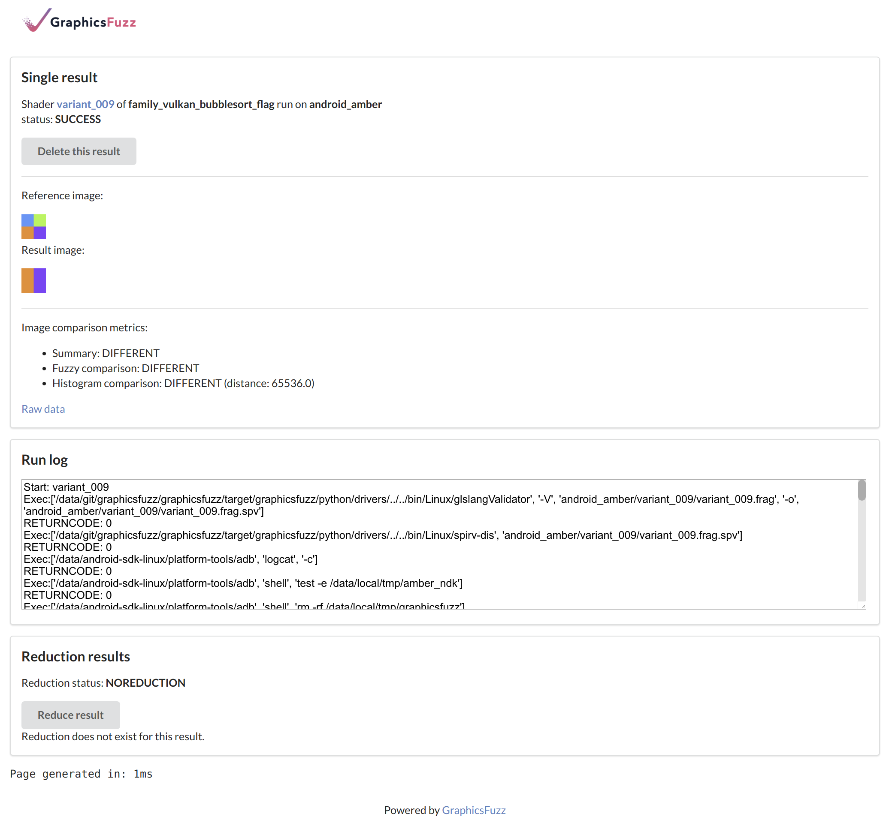
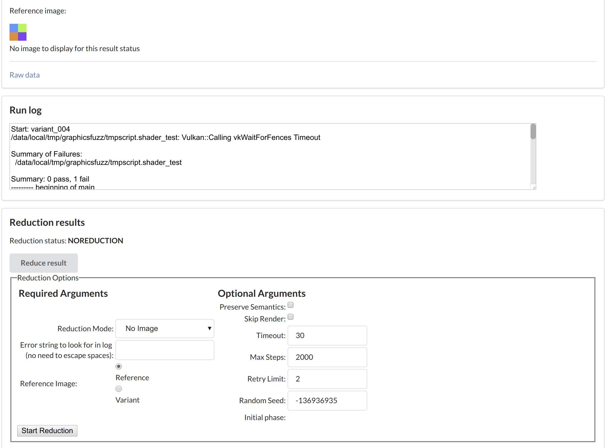

# Introduction

GraphicsFuzz is a testing framework for automatically finding and simplifying bugs in graphics shader compilers.

In this guide, we will briefly show how you might use each feature of GraphicsFuzz from start to finish. In practice, you may not want to use every feature; for example, you may want to use our pre-generated shader families instead of generating your own.

We will be using the latest release zip and the Desktop or Android worker. You can download these from the [GitHub releases page](https://github.com/google/graphicsfuzz/releases). If the latest versions of these are not available, you can [build them from source](development.md). If you want to use the Android worker you will also need an Android device or the Android device emulator.

We assume the release zip has been extracted to `/gf/`; thus, you will have `/gf/bin/`, `/gf/jar/`, `/gf/python/`, etc.

You will need to install the latest version of the Java 8 Development Kit,
either:

* From your system's package manager. E.g. `sudo apt-get install openjdk-8-jdk`.
* By [downloading and installing Oracle's binary distribution](http://www.oracle.com/technetwork/java/javase/downloads/index.html) (look for Java SE 8uXXX then the JDK link).
* By downloading and installing some other OpenJDK binary distribution for your platform.


```sh
# To check that Java 8 is installed and in use:
java -version
# Output: openjdk version "1.8.0_181"
```

## Generating shader families using the generator

GraphicsFuzz works by taking a *reference shader* and producing a family of *variant shaders*, where each variant should render the same image as the reference (modulo possible floating-point differences).


The reference shader and its variants together are referred to as a *shader family*.

The tool that generates shader families is known as the *generator*. The inputs to the generator are a reference shader and a folder of *donor shaders* (not pictured above). In theory, these input shaders can be any GLSL fragment shaders. In practice, we designed our tools to support shaders from glslsandbox.com, and so we currently only support shaders with uniforms as inputs (and the values for these will be fixed). Each shader file `shader.frag` must have a corresponding `shader.json` metadata file alongside it, which contains the values for the uniforms.

We can create some families shaders as follows:

```sh
# Change to the extracted release zip directory.
cd /gf

# Create a temp directory to store our shader families.
# The directory structure will allow our server
# to find the shaders later.
mkdir -p temp/work/shaderfamilies

# Generate several shader families from the set of sample shaders.
# Synopsis:
# generate_shader_families [options] donors references num_variants glsl_version prefix output_folder
#
# If instead you want to generate GLSL ES 1.00 shaders, change
# shaders/samples/300es to shaders/samples/100, and "300 es" to "100"
python/drivers/generate_shader_families --max_bytes 500000 --multi_pass shaders/samples/donors shaders/samples/300es 10 "300 es" a_shader_family temp/work/shaderfamilies

# The script above will take approx. 1-2 minutes to run, and will generate a shader family for every shader in shaders/samples/300es:
ls temp/work/shaderfamilies
# Output:
# a_shader_family_bubblesort_flag
# a_shader_family_mandelbrot_blurry
# a_shader_family_squares
# a_shader_family_colorgrid_modulo
# a_shader_family_prefix_sum
```

## Running the server

The server application is used to drive the testing of different devices by
communicating with worker applications that run on the devices.

```sh
# Change to the extracted release zip directory.
cd gf/

# The server uses the current directory as its working directory
# so we must change directory.
cd temp/work

# Execute the server app.
# The server listens on port 8080 by default, but you can override
# this with e.g. --port 80
java -ea -jar ../../jar/server-1.0.jar
```

Now visit http://localhost:8080/webui
in your browser.
You should see several lists:
connected workers, disconnected workers,
and shader families.
You should see the shader families that we generated
in the previous section. We will later queue shader families to
some connected workers.


## Running workers

We will now run some worker applications
that connect to the server, allowing us to test the devices on which
the workers run.

### Desktop worker

To test your current device (or any other desktop or laptop device), download
the latest desktop worker jar: look for `desktop-1.0.jar` on the GitHub
release. If you build from source, you should find it in
`platforms/libgdx/OGLTesting/desktop/build/libs/desktop-1.0.jar`.

You will need to create a `token.txt` file in the same directory
with one line containing the token (a name for the device you are testing). E.g.

```sh
echo paul-laptop-linux > token.txt
```

Then execute the following:

```sh
# Use `--help` to see options
# Use `--server` to specify a server URL (default is http://localhost:8080/)
java -ea -jar desktop-1.0.jar
```

You should see a relatively small window containing some animated white text on
a black background, including the text `state: GET_JOB`. In the terminal, you
should see repeating text similar to:

```sh
JobGetter: Got a job.
Main: No job for me.
Main: Waiting 6 ticks.
```

If you see `state: NO_CONNECTION` in the window, then the worker application
is failing to connect to the server.

### Android worker

From your Android device,
download the latest `android-debug.apk` (e.g. using the Chrome app) from the [GitHub releases page](https://github.com/google/graphicsfuzz/releases)
and open the apk file to install the app.

> You may need to allow installation of apps from unknown sources.
> See the [Android notes section](development.md#Android_notes)
> of the developer documentation for
> various settings that you may need to change on your Android device,
> and for other ways of installing the app.

You can now open the GraphicsFuzz app from your app drawer;
the screen may briefly rotate and then return to normal,
as if the app has crashed,
but the app should then start and the screen will remain
black with animated text,
similar to the desktop worker.

> To exit the app, you must use the back button, otherwise it will automatically restart.

The app should show a dialogue where you can enter the URL of the server.
If your Android device and server are on the same network,
you can enter your desktop/laptop hostname and port,
or your desktop/laptop IP address and port.

E.g. `paul-laptop:8080` or `192.168.0.4:8080`.

However, this will usually not work
if you are connected to a university, public, or corporate network.
Alternatively, you can connect your device
via USB, execute `adb reverse tcp:8080 tcp:8080` on your desktop/laptop,
and use `localhost:8080` as the server address.
See the [Android networking guide](android_networking_guide.md)
for more detailed instructions.

> If you need to enter a new server address, you will need to clear the app's data. E.g. by uninstalling and reinstalling the app.

The app will show a second dialogue where you must enter the
token (a name for the device).
Once you have entered a token,
you should see a mostly black screen with
animated text that contains `state: GET_JOB`.
If you see `state: NO_CONNECTION` then
the worker application
is failing to connect to the server.

## Queuing shader families to a worker

Return to the Web UI
at http://localhost:8080/webui
and refresh the page.
You should see the workers under "Connected workers".
We can now queue some shader familes to the workers:

* Click "Run shader families on workers".
* Select one or more workers via the checkboxes under "Workers".
* Select one or more shader families via the checkboxes under "Shader families".
* Click "Run jobs".

You should see the worker applications rendering images;
these images are being captured and uploaded to the server.

## Viewing shader family results

Return to the Web UI
at http://localhost:8080/webui
and click on one of the connected workers,
and then click on one of the shader families:
you should see a table of images.
Alternatively,
just click on one of the shader families to view
the results for this family across all workers.


In the example above,
the image for shader `variant_001` differs from the rest.
Recall that all images should be identical,
thus `variant_001` has exposed a bug in the
device that causes the wrong image to rendered.

Clicking on `variant_001`
reveals the GLSL fragment shader source that
triggered the bug:


However,
this shader is much larger and more complex than it needs to be
to expose the bug. Thus,
in the next section,
we will reduce the shader to obtain a smaller and simpler shader
that is more useful in understanding the root cause of the bug.


## Queuing a bad image reduction

Return to the results table view:


Click on the image under `variant_001`
to reveal the single result page,
and click the "Reduce result" button
to reveal the reduction panel:



From here,
we can queue a reduction of the variant shader
to find a smaller, simpler shader
that still exposes the bug.
The default reduction settings are sufficient, so just click
"Start reduction".

Once again, you should see the worker application rendering images.
Once the reduction has finished,
refresh the page and you should see the result:


In particular, you can see the difference between the
reference shader and the reduced variant shader;
in the above example,
adding just 4 lines (that should have no effect) to the reference shader
was enough to cause the wrong image to be rendered.

> The diff view currently assumes that the `diff` command line tool is
> available and on the path, which may not be the case on your system.

## Queuing a crash reduction

The results table for the shader family below shows
that `variant_004` failed to render due to a crash:


Click on the red table cell to view the single result page
and click "Reduce result" to reveal the reduction panel:



In the "Error Regex" text box, enter
a substring from the "Run log" text box that
will confirm the issue.
For example,
in this case,
we could enter "Fatal signal 11".
Ideally, we should enter something even more specific,
such as a function name from a stack trace,
but this is only possible if a stack trace is shown
in the run log.

> The "Error Regex" text will be prepended and appended with `.*`
> and matched as a regular expression against the run log.

The other default settings are sufficient, so click "Start Reduction".

This time, you will not see the worker rendering images,
as most attempts will cause the worker to crash,
as expected.

Once the reduction has finished,
refresh the page and you should see the result.
However, for crash reductions,
the diff view makes little sense,
as the reducer will have removed as much code as possible
(due to the "Reduce Everywhere" option).
Thus, click "View reduced shader" to
see the small, simple shader that triggers the bug:


In the above example,
a function body that contains a somewhat complex `pow` function call
is enough to trigger the bug.


## File system

You can see results in the file system within the server's working directory at following locations:

* Shader family results:

`work/processing/[token]/[shader_family]/`.

* Reduction result:

`work/processing/[token]/[shader_family]_variant_[number]_inv/`.


