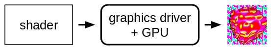
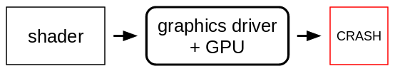
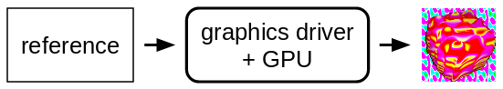
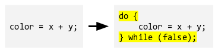
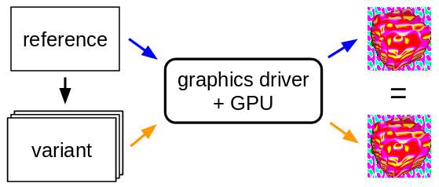
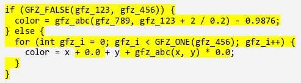
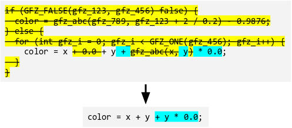

# How it works: metamorphic testing using glsl-fuzz

`glsl-fuzz` is a testing framework for automatically finding and simplifying bugs in graphics shader compilers. The tool works by generating tests from GLSL shaders.  These can be used to test shader compilers in OpenGL/OpenGL ES drivers, as well as SPIR-V shader compilers in Vulkan drivers via transpilation to SPIR-V -- the tool supports both these use cases.  Similarly, transpilation could be used to target shader compilers for HLSL and Metal in the future.

## The problem

A graphics driver takes one or more *shaders* as input and executes them on a GPU (graphics processing unit) to render an image.
Shaders are typically written in a C-like language,
such as GLSL.

Compiling and executing shaders is complex, and many graphics drivers are unreliable: a valid shader can lead to wrong images, driver errors or even security issues.

## Automatically finding bugs

We start with a *reference shader* that renders an image. The reference shader can be any shader you like, such as a high-value shader from a game or existing test suite.

Shaders are programs, so by applying *semantics-preserving* source code transformations, we can obtain a shader with significantly different source code that still has the same effect.

For example, wrapping code in a single-iteration loop does not change the meaning (semantics) of a program. By applying various semantics-preserving transformations to the reference shader, we generate a family of *variant shaders*, where each variant must render the same image as the reference.

If a variant shader leads to a seriously different image (or a driver error), then we have found a graphics driver bug!

This approach is known as *metamorphic testing*.

## Reduction

Finding bugs is not the end of the story: a variant shader that exposes a bug is typically very large (thousands of lines), full of code coming from the semantics-preserving transformations. Typically only a fraction of this code is needed to expose the bug.

Fortunately, our reducer is able to selectively reverse those transformations that are not relevant to the bug. After reduction, we obtain a small difference sufficient to expose the driver issue.

The reduced variant *still exposes the bug*, and differs from the reference only slightly: this is a great starting point to isolate the root cause of the bug in the graphics driver.

## Summary

GraphicsFuzz finds bugs in graphics drivers by rendering families of semantically equivalent shaders, and looking for output discrepancies. This approach is known as *metamorphic testing*. For each bug, the reducer saves a lot of debugging time by producing a simpler *minimal-difference test case* that still exposes the bug.

To learn more, check out the [walkthrough](glsl-fuzz-walkthrough.md).
