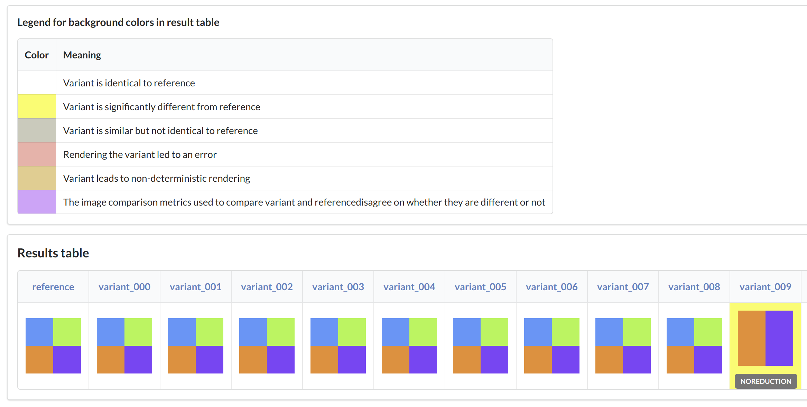
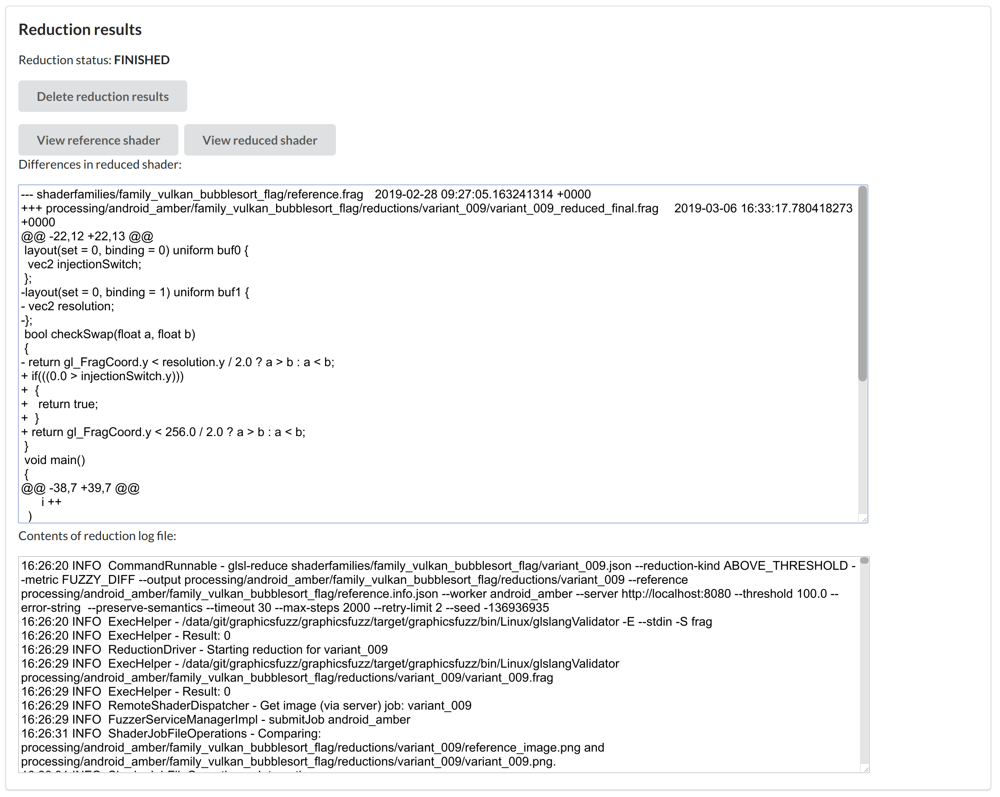

# glsl-fuzz walkthrough

glsl-fuzz is a testing framework for automatically finding and simplifying bugs in graphics shader compilers
by generating, running, and reducing GLSL shaders.

In this walkthrough, we will briefly demonstrate most features of glsl-fuzz from start to finish, including our browser-based UI.
We present commands assuming a Linux/Mac environment,
but Windows users can adapt the commands or
use the Git Bash shell.

The use of `glsl-fuzz` can be roughly split into the following steps:

* **Generate some shaders** using `glsl-generate` on your desktop.
* **Run the shaders** using `glsl-server` on your desktop
 and our *worker applications* on the devices you wish to test, such as Android devices.
* **Reduce the buggy shaders**, again using `glsl-server` on your desktop
and our *worker applications* on your devices.
Internally, `glsl-server` calls the command line reducer tool
`glsl-reduce`.

The `glsl-generate` and `glsl-reduce` tools can be used
stand-alone, without the `glsl-server` tool and worker applications,
but we focus on using our entire set of tools
in this walkthrough.


## Requirements

**Summary:** you need the latest release zip and worker applications, Java 8+, Python 3.5+, `amber` on your `PATH` (for desktop Vulkan testing), `amber_ndk` on your device (for Android Vulkan testing), and `adb` on your path (for Android Vulkan testing).

### Release zip and workers

We will be using the latest release zip `graphicsfuzz.zip` and worker applications.
You can download these from the [releases page](glsl-fuzz-releases.md)
or [build them from source](glsl-fuzz-develop.md).
If you want to use the Android worker you will also need an Android device
or the Android device emulator.

Add the following directories to your path:

* `graphicsfuzz/python/drivers`
* One of:
  * `graphicsfuzz/bin/Linux`
  * `graphicsfuzz/bin/Mac`
  * `graphicsfuzz/bin/Windows`

The `graphicsfuzz/` directory is the unzipped release.
If building from source, this directory can be found at `graphicsfuzz/target/graphicsfuzz/`.

### Amber

In March 2019, we deprecated our legacy Vulkan worker in favor of
[Amber](https://github.com/google/amber). See the [legacy Vulkan
worker documentation](legacy-vulkan-worker.md) if you need to use the old worker.

For testing Vulkan drivers on Android, you need to build [Amber](https://github.com/google/amber) as a native
Android executable by following the
[build instructions](https://github.com/google/amber), and push the `amber_ndk` binary to `/data/local/tmp/` on any device you want to test.
Also ensure that the binary is executable.
For testing Vulkan drivers on desktop, you need to build Amber on the relevant
platform, and add it to your `PATH`.

See [Build Amber for the Vulkan worker](glsl-fuzz-develop.md#build-amber-for-the-vulkan-worker) for more detailed instructions
and a last known good commit hash.


### Java 8+

You will also need to install the latest version of the Java 8 Development Kit,
either:

* From your system's package manager. E.g. Ubuntu: `sudo apt-get install openjdk-8-jdk`.
* By [downloading and installing Oracle's binary distribution](http://www.oracle.com/technetwork/java/javase/downloads/index.html) (look for Java SE 8uXXX then the JDK link).
* By downloading and installing some other OpenJDK binary distribution for your platform.


```sh
# To check that Java 8 is installed and in use:
java -version
# Output: openjdk version "1.8.0_181"
```

### Python 3.5+

You will need to install Python 3.5 or higher, either:

* From your system's package manager. E.g. Ubuntu: `sudo apt-get install python3`.
* By downloading from [https://www.python.org/downloads/](https://www.python.org/downloads/).
* By downloading and installing some other Python 3 distribution.

For Windows: most recent installers of Python
add `py`, a Python launcher, to your path.
Our scripts attempt to use `py -3 SCRIPT.py` to
execute `SCRIPT.py` using Python 3.5+.

For shells (other than Windows command prompt):
our scripts attempt to use `python3`,
then `py -3`, then `python`.
Set `PYTHON_GF` to override the Python
command. For example, `export PYTHON_GF=python3.6`.

### `adb`

The Vulkan worker for Android requires that `adb` is on your path.
We recommend installing the Android SDK,
[as described in our Android notes documentation](android-notes.md),
and adding the `platform-tools` directory to your path,
although you can technically just unzip the
platform tools zip file without installing the rest of the SDK.


## Generating shaders using `glsl-generate`

GraphicsFuzz works by taking a *reference shader* and producing a family of *variant shaders*, where each variant should render the same image or compute the same results as the reference (modulo possible floating-point differences).


The reference shader and its variants together are referred to as a *shader family*.

The `glsl-generate` tool generates shader families. The inputs are a folder of reference shaders
and a folder of *donor shaders* (not pictured above).

> The *donor shaders* are a corpus of shaders;
> `glsl-generate` will copy chunks of code from the donor shaders
> into each generated shader.

Although `glsl-generate` supports
GLSL fragment, vertex, and compute shaders,
our well-tested use-cases are:

* fragment shaders that only use uniforms as inputs
* compute shaders that only use a single SSBO plus uniforms as inputs

Our worker applications can only set uniforms and SSBOs
(they cannot set textures, etc.).
Thus,
we will focus on these use-cases for the walkthrough.

Each shader input is, in fact,
a JSON file that we refer to as a
**shader job**.
This file contains the set of uniforms (and their values)
that will be set, as well as details about the SSBO
and the number of work groups for a compute shader;
[we discuss the format of the JSON file in more detail below](#format-of-json-files).
For example, from our release zip:

`graphicsfuzz/shaders/samples/300es/squares.json`:

```json
{
  "time": {
    "func": "glUniform1f",
    "args": [
      0.0
    ]
  },
  "mouse": {
    "func": "glUniform2f",
    "args": [
      0.0,
      0.0
    ]
  },
  "resolution": {
    "func": "glUniform2f",
    "args": [
      256.0,
      256.0
    ]
  }
}
```

The fragment or compute shader file for this shader job
must have the same name and be alongside the shader job file
with a `.frag` or `.comp` extension;
in this case, at `graphicsfuzz/shaders/samples/300es/squares.frag`.
Thus, the inputs and outputs for `glsl-generate` are actually
folders of shader jobs.

### Generating some shader families

We can create some shader families from our provided sample shader jobs as follows, assuming you have extracted the `graphicsfuzz.zip` file to get `graphicsfuzz/`:

```sh
# Copy the sample shaders into the current directory:
cp -r graphicsfuzz/shaders/samples .

# Generate several shader families from the set of sample shaders.
# Placing the generated shaders under work/shaderfamilies will allow the server to find the shaders later.
# Synopsis:
# glsl-generate [options] references donors num_variants prefix output_folder
#
# In all cases below, we use the same directory for references and donors

# Generate some GLSL version 300 es fragment shaders.
glsl-generate --seed 0 samples/300es samples/300es 10 family_300es work/shaderfamilies

# Generate some GLSL version 100 fragment shaders.
glsl-generate --seed 0 samples/100 samples/100 10 family_100 work/shaderfamilies

# Generate some "Vulkan-compatible" GLSL version 310 es fragment shaders that can be translated to SPIR-V for Vulkan testing.
glsl-generate --seed 0 --vulkan --max-uniforms 10 samples/310es samples/310es 10 family_vulkan work/shaderfamilies

# Generate some "Vulkan-compatible" GLSL version 310 es compute shaders that can be translated to SPIR-V for Vulkan testing.
glsl-generate --seed 0 --vulkan --max-uniforms 10 samples/compute/310es samples/compute/310es 10 family_vulkan_compute work/shaderfamilies

# Each line above will take approx. 1 minute, and will generate a shader family for every
# shader in samples/300es, samples/100, samples/310es and samples/compute/310es:
ls work/shaderfamilies

# Output (this will differ according to changes in the sample shaders that are
# provided in practice):

# family_100_bubblesort_flag
# family_100_mandelbrot_blurry
# family_100_squares
# family_100_colorgrid_modulo
# family_100_prefix_sum

# family_300es_bubblesort_flag
# family_300es_mandelbrot_blurry
# family_300es_squares
# family_300es_colorgrid_modulo
# family_300es_prefix_sum

# family_vulkan_bubblesort_flag
# family_vulkan_mandelbrot_blurry
# family_vulkan_squares
# family_vulkan_colorgrid_modulo
# family_vulkan_prefix_sum

# family_vulkan_compute_comp-0001-findmax
# family_vulkan_compute_comp-0002-smooth-mean
# family_vulkan_compute_comp-0003-random-middle-square
# family_vulkan_compute_comp-0004-koggestone
# family_vulkan_compute_comp-0005-sklansky
# family_vulkan_compute_frag2comp-0001-bubblesort_flag
# family_vulkan_compute_frag2comp-0002-colorgrid_modulo
# family_vulkan_compute_frag2comp-0003-mandelbrot_blurry
# family_vulkan_compute_frag2comp-0004-prefix_sum
# family_vulkan_compute_frag2comp-0005-squares
```

> The commands above are deterministic because we passed `--seed 0`.
> Omit this argument to use a random seed and generate different
> shaders each time.

Each shader family contains 11 shader jobs;
1 for the reference shader, and 10 for the variant shaders:

```sh
ls work/shaderfamilies/family_100_bubblesort_flag/

# Output:

# infolog.json      variant_001.json  variant_004.json  variant_007.json
# reference.frag    variant_002.frag  variant_005.frag  variant_008.frag
# reference.json    variant_002.json  variant_005.json  variant_008.json
# variant_000.frag  variant_003.frag  variant_006.frag  variant_009.frag
# variant_000.json  variant_003.json  variant_006.json  variant_009.json
# variant_001.frag  variant_004.frag  variant_007.frag
```

Note that `infolog.json` is not a shader job;
it is simply a JSON file containing some metadata about how the
shader family was generated.

## Running the server

The `glsl-server` application is used to drive the testing of different devices by
communicating with worker applications that run on the devices.

> You do not have to use the server or worker applications;
> `glsl-generate` and `glsl-reduce` can be used as stand-alone
> command line tools, although you will need to write a script
> that can utilize your shaders.

You can start `glsl-server` as follows:

```sh
# The server uses the current directory as its working directory
# so we must change to our `work` directory.
cd work

# Check that the shader families are here.
ls
# Output:
# shaderfamilies
# processing <-- only if you have previously run the server here.

# Execute the server app.
# The server listens on port 8080 by default, but you can override
# this with e.g. --port 80
glsl-server
```

Leave the server running in your terminal.

Now visit [http://localhost:8080/webui](http://localhost:8080/webui)
in your browser.
You should see several lists:
connected workers, disconnected workers,
and shader families.
You should see the shader families that we generated
in the previous section. We will later queue shader families to
some connected workers.


## Running workers

We will now run some worker applications that connect to the server, allowing us
to test the devices on which the workers run.

### Vulkan worker

The Vulkan worker is based on Amber (see [amber in requirements](#amber)) to
enable testing Vulkan drivers on Android, Linux, and Windows.

> We previously shipped our own legacy Vulkan worker app, which is now
> deprecated. Please switch to Amber.

For Android, the Vulkan worker requires running `glsl-to-spv-worker` on a desktop machine, with
the Android device accessible via adb:

```
glsl-server     <--- HTTP --->    glsl-to-spv-worker (calls runspv)   --- adb commands --->   amber, or legacy vulkan worker
(on a desktop)                    (on a desktop)                                              (on an Android device)
```

> Note that the `runspv` script uses the `adb` tool to copy the shader files to
> the device, run `amber_ndk` or the legacy worker, and copy back the results.
> `runspv` can be used as a standalone tool to run shaders in GLSL or SPIR-V format.
> [We describe this in more detail below](#running-shaders-from-the-command-line).

To start a Vulkan worker, make sure Amber is installed (see [amber in
requirements](#amber)). On desktop, `amber` should be on your `PATH`.

You can then use the `glsl-to-spv-worker` script to connect to the server:

```sh
# Make a directory for the worker.
mkdir pixel3
cd pixel3

# Execute the worker script, passing the worker name and the target
# ('android' or 'host') as arguments.
# Add `--help` to see options
# Add `--server` to specify a server URL (default is http://localhost:8080)
# Add `--spirvopt=-O` to run `spirv-opt -O` on every shader.
# Add `--serial 123ABC` to specify the serial number of the Android device
#   to target (found using `adb devices -l`)
glsl-to-spv-worker pixel3 android
```

> You can safely ignore any warnings related to `vkworker`.

Note that running `spirv-opt` on each shader by adding the `--spirvopt=ARGS`
argument can help find additional bugs that would otherwise not be found.  This
approach can also find bugs in `spirv-opt` itself.

You should see `No job` repeatedly output to the terminal.

If you see `Cannot connect to server` then the worker script is failing to
connect to the server.

The intermediate files are saved in the current directory under
`WORKER_NAME/SHADER_NAME/` subdirectories.
For example, we might have a worker name of `pixel3`
receiving shaders named `variant_000`, `variant_001`, etc.
So, for example, under `pixel3/variant_000` we will see:

```sh
tmpscript.shader_test    # The self-contained Amber script test file for input to amber.
variant_000.json         # The shader job file (containing uniforms data).
variant_000.frag         # The GLSL fragment shader.
variant_000.frag.spv     # The SPIR-V version of the fragment shader.
image_0.png              # The image produced by the device.
```

Don't care about the other kinds of worker? [Skip ahead to running shaders on workers](#running-shaders-on-the-worker-applications).

### `gles-desktop-worker`

To test the OpenGL drivers on a
Mac, Linux, or Windows desktop device,
open a new terminal, navigate to a location of your choice, and
download the latest `gles-worker-desktop.jar` file from the
[releases page](glsl-fuzz-releases.md) into your current directory.

You will need to create a `worker-name.txt` file in your current directory with one
line containing the worker name to identify your device. E.g.

```sh
echo my-laptop > worker-name.txt
```

Then execute the following:

```sh
# Add `--help` to see options
# Add `--server` to specify a server URL (default is http://localhost:8080/)
java -ea -jar gles-worker-desktop.jar
```

You should see a small window containing some animated white text on
a black background, including the text `state: GET_JOB`. In the terminal, you
should see repeating text similar to:

```sh
JobGetter: Got a job.
Main: No job for me.
Main: Waiting 6 ticks.
```

If you see `state: NO_CONNECTION` in the window, then the worker application
is failing to connect to the server.

Assuming the worker has succeeded in connecting to the server, leave the worker running in its terminal window.

Don't care about the other kinds of worker?  [Skip ahead to running shaders on workers](#running-shaders-on-the-worker-applications).

### `gles-worker-android`

To test the OpenGL ES drivers on an Android device,
download the latest `gles-worker-android-debug.apk` file
from the [releases page](glsl-fuzz-releases.md).
You can download the .apk file from your device directly
(e.g. using the Chrome app)
and open the .apk file to install it,
or you can install it using `adb`.

> You may need to allow installation of apps from unknown sources.
> See the [Android notes](android-notes.md)
> for
> various settings that you may need to change on your Android device,
> and for other ways of installing the app.

You can now open the GraphicsFuzz app from your app drawer;
the screen may briefly rotate and then return to normal,
as if the app has crashed,
but the app should then start and the screen will remain
black with animated text,
similar to the desktop worker.

> Note that the `gles-worker-android` app may crash a lot,
> and it will automatically restart;
> this is usually because the graphics driver crashed when running
> a complex shader.
> However, it may terminate intentionally if it detects any errors,
> such as when the network connection between the worker and server
> fails.
> The crash-happy approach is a self-defense mechanism to try
> to ensure that we return to a good state before continuing.

> To exit the app, you **must use the back button**, otherwise it will automatically restart.

The app should show a dialogue where you can enter the URL of the server.
If your Android device and server are on the same network,
you can enter your desktop/laptop hostname and port,
or your desktop/laptop IP address and port.

E.g. `paul-laptop:8080` or `192.168.0.4:8080`.

However, this usually won't work on university, public, or corporate networks.
Alternatively, you can connect your device via USB, execute `adb reverse
tcp:8080 tcp:8080` on your desktop/laptop, and use `localhost:8080` as the
server address. See the [Android notes](android-notes.md) for more detailed
instructions.

> If you need to enter a new server address, you will need to clear the app's data. E.g. by uninstalling and reinstalling the app.

The app will show a second dialogue where you must enter the worker name.  Once
you have entered a name, you should see a mostly black screen with animated text
that contains `state: GET_JOB`.  If you see `state: NO_CONNECTION` then the
worker application is failing to connect to the server.


## Running shaders on the worker applications

> Running of compute shaders is only supported for the Amber-based Vulkan worker (on both desktop and Android).  Compute shaders are not supported by the GLES workers.

Return to the Web UI
at [http://localhost:8080/webui](http://localhost:8080/webui)
and refresh the page.
You should see the workers under "Connected workers".
We can now queue some shader families to the workers:

* Click "Run shader families on workers".
* Select one or more workers via the checkboxes under "Workers".
* Select one or more shader families via the checkboxes under "Shader families".
* Click "Run jobs".

> Note that only Vulkan-compatible shaders can be run on Vulkan workers;
> the Vulkan-compatible shader families that we generated earlier start with
> `family_vulkan_`.

## Viewing fragment shader family results

> Viewing of compute shader family results in the Web UI is not supported.
> [Instructions for inspecting compute shader results are provided below](#inspecting-results-for-compute-shader-families).

Return to the Web UI
at [http://localhost:8080/webui](http://localhost:8080/webui)
and click on one of the connected workers,
and then click on one of the shader families:
you should see a table of images.
Alternatively,
just click on one of the shader families to view
the results for this family across all workers.



> Note the Legend in the screenshot above.
> Two image comparison metrics are used to comare the actual rendered image
> with the expected reference image: *histogram* and *fuzzy diff*.
> The histogram comparison compares the overall colors of the images up to some
> default threshold,
> while the fuzzy diff algorithm compares pixel locations with various thresholds
> for pixel-movement and color variation.
> We find that both metrics combined are informative.
> The background color of each table cell indicates whether the image appears to be
> incorrect according to both metrics.

In the example above,
the image for shader `variant_009` differs from the rest.
Recall that all images should be identical,
thus `variant_009` has exposed a bug that causes the wrong image to rendered.

Clicking on `variant_009`
reveals the GLSL fragment shader source that
triggered the bug:


However,
this shader is much larger and more complex than it needs to be
to expose the bug. Thus,
in the next section,
we will reduce the shader to obtain a smaller and simpler shader
that is more useful in understanding the root cause of the bug.

Return to the results table view
and click on the image under `variant_009`
to reveal the single result page.


*Images sizes have been reduced to fit more information into the screenshot.*

As seen above,
the reference image and result image are shown for comparison,
as well as the results of the individual image comparison metrics
(if the images are different).
The *histogram distance* is shown, which can be useful when
launching a reduction, as explained below.


## Queuing a bad image reduction

> Reductions for bad results from compute shaders cannot be launched via the Web UI.  [See how to launch them via the command line](#Performing-a-bad-result-reduction-for-a-compute-shader).


From the single result page,
click the "Reduce Result" button to reveal the reduction panel,
as shown in the above screenshot.
From here,
we can queue a reduction of the variant shader
to find a smaller, simpler shader
that still exposes the bug.
The "fuzzy diff" algorithm is selected by default,
which will work in this case,
as both metrics detected the image as different from the reference.
You can select the "HISTOGRAM_CHISQR" metric from the "Comparison metric" dropdown;
a threshold field will be revealed so that you can adjust
the threshold value based on the histogram distance reported
higher up the page, although we find that the default value of `100.0` usually works well.
In this case,
the default reduction settings are sufficient, so just click
"Start reduction".

> Note that the server will not progress with the reduction until
> all prior work for the specified worker has finished.
> Thus, if you previously queued a large number of shader families
> to this worker,
> they will continue to run before the reduction starts executing
> on the worker. You can kill and restart the server to clear its
> work queues.

Refresh the page to check the progress of the reduction.
Once the reduction has finished,
you should see the result:



In particular, you can see the difference between the
reference shader and the reduced variant shader.
The results will depend on what shader compiler bugs (if any!) you find on your platform, but
in the above example,
adding just a few lines (that should have no effect) to the reference shader
was enough to cause the wrong image to be rendered.

> The diff view currently assumes that the `diff` command line tool is
> available on the path, which may not be the case on your system.

## Queuing a no image reduction

> Reductions for the case where no SSBO is produced by a compute shader cannot be launched via the Web UI.  [See how to launch them via the command line](#Performing-a-no-image-reduction-on-a-fragment-or-compute-shader).

The results table for the shader family below shows
that `variant_004` failed to render due to a crash:


> The CRASH status indicates that no image was produced; the
> worker may not have necessarily crashed.

Click on the red table cell to view the single result page
and click "Reduce result" to reveal the reduction panel:


In the "Error string" text box, enter a substring from the "Run log" text box
that will confirm the issue.  For example, in this case, we could enter
"Calling vkWaitForFences Timeout" (without quotes).
Another common string is: "Fatal signal 11".
Ideally, we should enter something even more specific, such as a
function name from a stack trace, but this is only possible if a stack trace is
shown in the run log.

> Enabling the "Skip Render" option causes the worker to only compile the shader,
> without rendering an image, which is much faster.
> However, you must ensure that this is still sufficient to trigger
> the required error string output.
> If you enable "Skip Render",
> the reduction will fail almost instantly if the error string output
> does not appear, in which case you can try again without "Skip Render".

The default settings are sufficient, so click "Start Reduction".

Once the reduction has finished,
refresh the page and you should see the result.
However, for crash reductions,
the diff view makes little sense,
as the reducer will have removed as much code as possible
(because the "Preserve Semantics" option was disabled).
Thus, click "View reduced shader" to
see the small, simple shader that triggers the bug:


## After updating a device

If you update a device,
its "fingerprint" will change
and the server will usually reject it.
The simplest solution is to give the worker a new name.
This also allows you to compare
results across different versions of your device
in the Web UI,
without having to delete your old results.


## Exploring results in the file system

You can see results in the file system within the server's working directory at the following locations:
* Shader family results are under `work/processing/<worker>/<shader_family>/`
* Reduction results are under `work/processing/<worker>/<shader_family>/reductions/<variant>/`

### Shader family results

Under `work/processing/<worker>/<shader_family>/`, each variant produces the following files:
* `<variant>.info.json`
* `<variant>.txt`
* `<variant>.png` (only for `SUCCESS` status)
* `<variant>.gif` (only for `NONDET` status)
* `<variant>_nondet1.png` (only for `NONDET` status)
* `<variant>_nondet2.png` (only for `NONDET` status)

`<variant>.info.json` describes the result of running the variant shader,
in the following JSON format:

```shell
{
  "status": "SUCCESS",
  ... other fields ...
}
```

The `status` field is a string summarizing the result. It can be:
* `SUCCESS`: the variant rendered an image
* `CRASH`: the variant led to a driver crash
* `NONDET`: the variant led to a non-deterministic rendering
*  `TIMEOUT`: the variant took too long to be processed (in the case of the
    Vulkan worker, this may indicate glslangValidator or spirv-opt taking too
    long to process the variant)
* `UNEXPECTED_ERROR`: the variant led to an unexpected error

This JSON also contains other fields, including different image comparison metrics
from comparing the variant image and the reference image.

`<variant>.txt` contains the log of the variant run. On Android, it is a dump of
the Android logcat, and can contain useful information, such as details on a
driver crash.

`<variant>.png` is the image produced by this variant. This file is present only
if the variant status is `SUCCESS`.

In case of `NONDET` status, two different images for this same variant are
stored in `<variant>_nondet1.png` and `<variant>_nondet2.png`. An animated GIF
is also produced in `<variant>.gif`.

### Reduction results

Under `work/processing/<worker>/<shader_family>/reductions/<variant>/`,
the reduction of this variant leads to the following files:

* `command.log` is the command with which the reducer was started
* `<variant>_reduced_<step_number>_<success_or_fail>.*` are the files associated with this given
  step of the reduction; `success` or `fail` indicates whether the reduction step succeeded in preserving the bug or not
* `<variant>_reduced_final.*` are the files at the final step of the
  reduction. It typically refers to the smallest shader the reducer could obtain
  for this particular reduction.


## Inspecting results for compute shader families

A compute shader takes its inputs via uniforms and a single SSBO, and writes results via the SSBO.  The final state of the SSBO for a compute shader is stored in the `ssbo` sub-field of the `outputs` field of the `.info.json` result file produced upon running the shader.  The `ssbo` subfield is a list of lists: there is one list for each field of the SSBO, and it contains a list of data elements associated with that field.

For instance, suppose a compute shader's SSBO is declared as follows:

```
layout(std430, binding = 0) buffer doesNotMatter {
 int result;
 int data[];
};
```

A possible end-state for the SSBO is:

```
[[88],[28,12,14,14,18,16,18,18,28,22,24,24,28,26,28,28,48,32,34,34,38,36,38,
38,48,42,44,44,48,46,48,48,68,52,54,54,58,56,58,58,68,62,64,64,68,66,68,68,88,72
,74,74,78,76,78,78,88,82,84,84,88,86,88,88]]
```

This corresponds to a value of 88 for the `result` field of the SSBO, and values of 28, 12, 14, etc., for the elements of the `data` array field.

### Showing the SSBO for a compute shader result

To view the SSBO for a compute shader result in pretty-printed form, do:

```sh
# The 'show' argument specifies that we wish to view the SSBO for the given result file
inspect-compute-results show /path/to/results/reference_or_variant.info.json
```

### Comparing SSBOs for two compute shader results

To compare SSBOs for two result files from the same shader family (typically the reference and a variant), do:

```sh
# The 'exactdiff' argument specifies that we wish to compare the SSBOs for the given result files, and that they should be identical
inspect-compute-results exactdiff /path/to/result/reference.info.json /path/to/result/variant_XXX.info.json
```

This will exit with code 0 if and only if the SSBOs associated with the two result files match *exactly*.  Otherwise, a mismatch will be reported and a non-zero exit code returned.

To tolerate some degree of floating-point difference when comparing SSBO entries, do:

```sh
# The 'fuzzydiff' argument specifies that we wish to compare the SSBOs for the given result files, and that we want to allow some tolerance of numerical differences
inspect-compute-results fuzzydiff /path/to/result/reference.info.json /path/to/result/variant_XXX.info.json
```

Fuzzy diffing uses the Python `isclose` function to compare numbers.  You can pass `--rel_tol` and `--abs_tol` to `inspect-compute-results` to control the relative and absolute tolerance used by `isclose`; see the [Python math documentation](https://docs.python.org/3/library/math.html) for details of the `rel_tol` and `abs_tol` arguments to `isclose`.

```sh
# Request a fuzzy diff with relative tolerance of 1e-5 and absolute tolerance of 0.1
inspect-compute-results fuzzydiff --rel_tol=1e-5 --abs_tol=0.1 /path/to/result/reference.info.json /path/to/result/variant_XXX.info.json
```

To see the default values for `--rel_tol` and `--abs_tol`, do:

```sh
inspect-compute-results --help
```

## Viewing summary results for a compute shader family

To see a summary of the results for a compute shader family, do e.g.:

```sh
report-compute-shader-family-results family_vulkan_compute_frag2comp-0005-squares

# Possible output below, where:
# - CRASH indicates that no results were produced
# - SUCCESS indicates that the compute shader ran successfully
# - EXACT_MATCH indicates that the SSBO results for a variant exactly match the reference
# - FUZZY_MATCH indicates that the SSBO results for a variant differ from the reference but by a tolerable amount
# - DIFFERENT indicates that the SSBO results for a variant differ from the reference by an intolerable amount
#
# family_vulkan_compute_frag2comp-0005-squares/reference.info.json: SUCCESS
# family_vulkan_compute_frag2comp-0005-squares/variant_007.info.json: SUCCESS, EXACT_MATCH
# family_vulkan_compute_frag2comp-0005-squares/variant_002.info.json: SUCCESS, FUZZY_MATCH
# family_vulkan_compute_frag2comp-0005-squares/variant_004.info.json: CRASH
# family_vulkan_compute_frag2comp-0005-squares/variant_006.info.json: SUCCESS, DIFFERENT
# family_vulkan_compute_frag2comp-0005-squares/variant_003.info.json: SUCCESS, EXACT_MATCH
# family_vulkan_compute_frag2comp-0005-squares/variant_009.info.json: SUCCESS, EXACT_MATCH
# family_vulkan_compute_frag2comp-0005-squares/variant_005.info.json: SUCCESS, EXACT_MATCH
# family_vulkan_compute_frag2comp-0005-squares/variant_000.info.json: SUCCESS, EXACT_MATCH
# family_vulkan_compute_frag2comp-0005-squares/variant_008.info.json: CRASH
# family_vulkan_compute_frag2comp-0005-squares/variant_001.info.json: SUCCESS, EXACT_MATCH
```

Arguments `--rel_tol` and `--abs_tol` can be used to control relative and absolute tolerance, [as described above](#Comparing-SSBOs-for-two-compute-shader-results).


## Running shaders from the command line

Sometimes it can be useful to run individual shaders
from the command line.

This can be achieved using the `run-shader-family` script,
which runs a single shader or a shader family
on a device, via the server.
For example:

```sh
# Run one shader
run-shader-family variant_001.json --server http://localhost:8080 --worker pixel3

# Run shader family directory `bubblesort_family`
run-shader-family bubblesort_family --output results/ --server http://localhost:8080 --worker pixel3
```

The results will be output to the current directory by default, or to the directory specified
by `--output`.
The output `.txt` files contain the run log for each shader.

### `runspv`

As described under the [Vulkan worker](vulkan-worker) section, the Vulkan worker
uses `runspv` to run shaders on the device. You can use this script directly if
you want to re-run some shaders.

Your device must show in `adb devices`.  For
example:

```sh
# add --spirvopt=-O to run spirv-opt on your shader
# add --serial 123ABC to specify the serial of your device from adb devices
runspv android variant_005.json outdir
```

However, note that `runspv` will fail if you have, for example,
both `variant_005.frag` and `variant_005.frag.spv`;
you must delete one of these files so `runspv` knows which file you want to test.
The temporary files and results will be output to `outdir/`.

## Reducing shaders from the command line using `glsl-reduce`

Behind the scenes, the server is invoking our command line tools.
In fact, the "reduction log" shown by the WebUI
(`command.log` in the file system)
includes the command that was run on its first line.
E.g.

`glsl-reduce shaderfamilies/family01/variant_01.json --reduction-kind [etc.]`

> You can try running these commands from the command line in the `work`
> directory, although note that some "empty" arguments (i.e. "")
> and arguments with spaces (e.g. --error-string "Fatal signal 11") may need to be
> quoted, and they will not be quoted in the reduction log.

### Performing a bad image reduction

Here is an example of a bad image reduction command,
similar to what the server would run.

```sh
# Summary:
#  glsl-reduce shader_job.json --reduction-kind ABOVE_THRESHOLD --reference result.info.json [other options]

glsl-reduce \
  shaderfamilies/sf1/variant_004.json \
  --preserve-semantics \
  --reduction-kind ABOVE_THRESHOLD \
  --threshold 100.0 \
  --metric HISTOGRAM_CHISQR \
  --reference processing/my-worker/sf1/reference.info.json \
  --output processing/my-worker/sf1/reductions/variant_004 \
  --max-steps 2000 \
  --timeout 30 \
  --retry-limit 2 \
  --seed -136936935 \
  --server http://localhost:8080 \
  --worker-name my-worker
```

Explanation:

* `shaderfamilies/sf1/variant_004.json`
  * The shader (job) to reduce.
* `--preserve-semantics`
  * Specifics that the reducer must not change the semantics of the shader when reducing;
this is essential when doing bad image reductions.
Thus, `glsl-reduce` will mainly just reverse the transformations that were added by `glsl-generate`,
although it can also do some other straightforward semantics-preserving reductions that are not
reversals, such as propagation of uniform values into the shader.
* `--reduction-kind ABOVE_THRESHOLD`
  * Interestingness test: the produced image is different from the reference image.
I.e. the image comparison value is LARGER than the threshold.
* `--threshold 100.0`
  * The threshold for image comparison: we have found 100.0 works well.
* `--metric HISTOGRAM_CHISQR`
  * Image comparison metric: by default, we use the Chi-Square distance between image histograms.
* `--reference processing/my-worker/sf1/reference.info.json`
  * The reference image is reference.png, but we must pass the associated .info.json file.
We do this because the reference result could be something other than an image,
such as a buffer of values for a compute shader.
* `--output processing/my-worker/sf1/reductions/variant_004`
  * Output directory: the reduced shader job will end up here, ending with *_reduced_final.json.
* `--max-steps 2000`
  * There will be at most 200 reduction steps.
* `--timeout 30`
  * Timeout for each run of the interestingness test.
* `--retry-limit 2`
  * If the worker fails to respond twice, assume the shader fails to render.
* `--seed -136936935`
  * Random seed for the reduction algorithm.
* `--server http://localhost:8080 --worker-name my-worker`
  * `glsl-reduce` will, by default, run shader jobs locally, which is not well-tested.
Specify a server and worker name to run the shader jobs on a worker that is connected
to the server.


### Performing a no image reduction on a fragment or compute shader

> Even though compute shaders do not produce images, a "no image" reduction can be performed on a compute shader to reduce cases where processing of the compute shader fails, such that an SSBO is not produced.

Here is an example of a no image reduction command,
similar to what the server would run.

```sh
# Summary:
#  glsl-reduce shader_job.json --reduction-kind NO_IMAGE --error-string "Fatal signal 11" [other options]

glsl-reduce \
  shaderfamilies/sf1/variant_007.json \
  --reduction-kind NO_IMAGE \
  --error-string "Fatal signal 11" \
  --output processing/my-worker/sf1/reductions/variant_007 \
  --max-steps 2000 \
  --timeout 30 \
  --retry-limit 2 \
  --seed -136936935 \
  --server http://localhost:8080 \
  --worker my-worker
```

Explanation:

* `shaderfamilies/sf1/variant_007.json`
  * The shader job to reduce.
* `--reduction-kind NO_IMAGE`
  * Interestingness test: no image (or SSBO) is produced, plus the error-string provided below must match
    the run log.
* `--error-string "Fatal signal 11"`
  * The run log must contain this string for the shader job to be regarded as interesting.
* `--output processing/my-worker/sf1/reductions/variant_007`
  * Output directory: the reduced shader job will end up here, ending with *_reduced_final.json.
* `--max-steps 2000`
  * There will be at most 200 reduction steps.
* `--timeout 30`
  * Timeout for each run of the interestingness test.
* `--retry-limit 2`
  * If the worker fails to respond twice, assume the shader fails to render.
* `--seed -136936935`
  * Random seed for the reduction algorithm.
* `--server http://localhost:8080 --worker my-worker`
  * `glsl-reduce` will, by default, run shader jobs locally, which is not well-tested.
We specify a server and worker name to run the shader jobs on a worker that is connected
to the server.


### Performing a bad result reduction for a compute shader

If you have a variant compute shader that produces a different SSBO result compared with its associated reference, you can reduce the problem as follows.

```sh
# Copy the .info.json file for the reference into your working directory
cp /path/to/reference.info.json .
# Make a copy of the template interestingness test for compute shader
# differences
cp graphicsfuzz/python/interestingness/compute-interesting-diff.py .
# Copy over a shell script wrapper for the interestingness test (only one of
# the following two files is required, but it does no harm to copy both)
cp graphicsfuzz/python/interestingness/compute-interesting-diff .
cp graphicsfuzz/python/interestingness/compute-interesting-diff.bat .

# Edit 'REFERENCE_RESULTS', 'WORKER_NAME' and 'SERVER_URL' in
# 'compute-interesting-diff.py' to suit your needs

# Run a reduction using 'compute-interesting-diff.py' to decide whether each
# reduced shader is interesting.  Results will be placed in 'someoutputdir'.
# --preserve-semantics ensures that only semantics-preserving changes are made
# during reduction.
glsl-reduce /path/to/bad/variant.json ./compute-interesting-diff --preserve-semantics --output someoutputdir
```

Sometimes it can be useful to reduce a compute shader while its SSBO continues to match an original result.  Another interestingness template is provided to facilitate this:

```sh
# This template can be used to reduce a compute shader while its results match
# 'reference.info.json'
graphicsfuzz/python/interestingness/compute-interesting-same.py
```

### Additional options

See the [glsl-reduce manual](glsl-fuzz-reduce.md) for details on other options.

## Format of JSON files

As described above, a shader job is identified by a JSON file.  This file can be used to specify concrete values for uniforms used by the associated shaders.

The file should contain a single dictionary of uniform value entries.

Here is an example uniform value entry:

```
  "iDate": {
    "func": "glUniform4f",
    "args": [
      2016.0,
      9.0,
      22.0,
      61200.0
    ],
    "binding": 5
  }
```

The key, `iDate`, is the name of the uniform.  This maps to a sub-dictionary specifying: via `func` the OpenGL function used to set the uniform (`glUniform4f` in this case, corresponding to a `vec4`), via `args` a sequence of values that should be used to populate the uniform (four floating point values in this case), and optionally via `binding` an integer which, if provided, must match the binding of the uniform buffer to which the uniform belongs.

In the case of compute shaders, the JSON file has a single additional entry with the key `$compute`.

Here is an example `$compute` entry:

```
  "$compute": {
    "num_groups": [ 4, 1, 1 ],
    "buffer": {
      "binding": 0,
      "fields":
      [
        { "type": "int", "data": [ 0 ] },
        { "type": "int", "data":
          [ 11, 12, 13, 14, 15, 16, 17, 18,
            21, 22, 23, 24, 25, 26, 27, 28,
            31, 32, 33, 34, 35, 36, 37, 38,
            41, 42, 43, 44, 45, 46, 47, 48,
            51, 52, 53, 54, 55, 56, 57, 58,
            61, 62, 63, 64, 65, 66, 67, 68,
            71, 72, 73, 74, 75, 76, 77, 78,
            81, 82, 83, 84, 85, 86, 87, 88 ]
        }
      ]
    }
  }
```

The key, `$compute`, distinguishes this entry from uniform entries.  This maps to a sub-dictionary specifying: via `num_groups` the number of work groups that should execute the compute shader, and via `buffer` details of the SSBO for the compute shader.  In turn, `buffer` maps to a sub-dictionary specifying: via `binding` the binding for the SSBO, and via `fields` the layout of the SSBO struct including types and initial values for its fields.  This consists of an ordered list of dictionaries, one per field, where each dictionary specifies: via `type` the base type of the field, and via `data` the initial values for the field.  In the above example there are two fields: a scalar `int` field initialized to 0, and an `int` array field, initialized to 11, 12, 13, etc.
