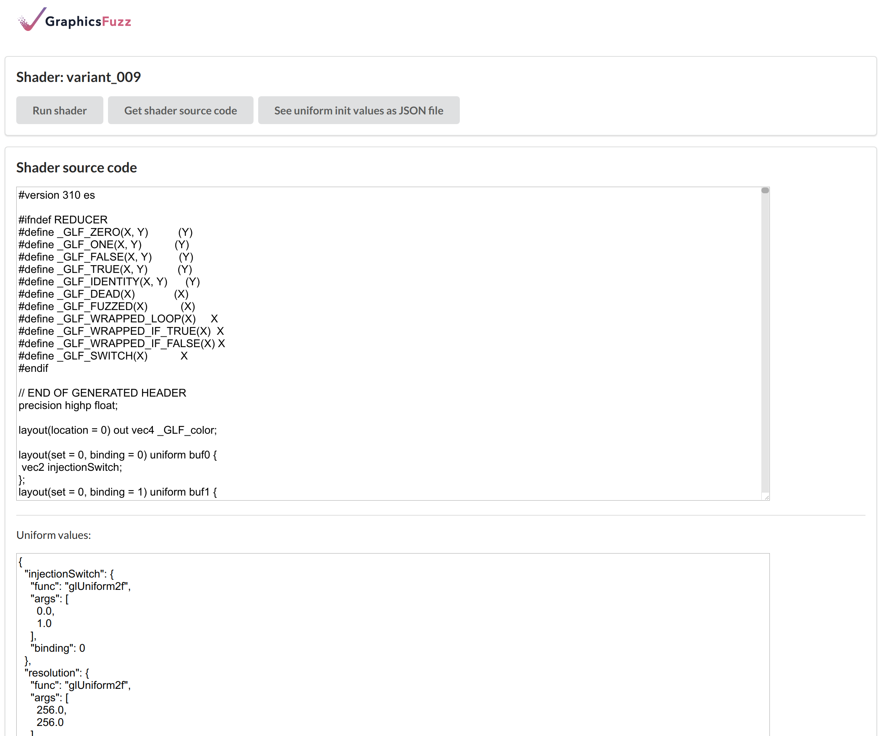

# glsl-fuzz walkthrough

glsl-fuzz is a testing framework for automatically finding and simplifying bugs in graphics shader compilers
by generating, running, and reducing GLSL shaders.

In this walkthrough, we will briefly demonstrate most features of glsl-fuzz from start to finish, including our browser-based UI.

The use of `glsl-fuzz` can be roughly split into the following steps:

* **Generate some shaders** using `glsl-generate` on your desktop.
* **Run the shaders** using `glsl-server` on your desktop
 and our *worker applications* on the devices you wish to test, such as Android devices.
* **Reduce the buggy shaders**, again using `glsl-server` on your desktop
and our *worker applications* on your devices.
Internally, `glsl-server` calls the command line reducer tool
`glsl-reduce`.

The `glsl-generate` and `glsl-reduce` tools can be used
stand-alone, without the `glsl-server` tool and worker applications,
but we focus on using our entire set of tools
in this walkthrough.


## Requirements

We will be using the latest release zip `graphicsfuzz-1.0.zip` and worker applications.
You can download these from the [releases page](glsl-fuzz-releases.md)
or [build them from source](glsl-fuzz-build.md).
If you want to use the Android worker you will also need an Android device
or the Android device emulator.

Add the following directories to your path:

* `graphicsfuzz-1.0/python/drivers`
* One of:
  * `graphicsfuzz-1.0/bin/Linux`
  * `graphicsfuzz-1.0/bin/Mac`
  * `graphicsfuzz-1.0/bin/Windows`

The `graphicsfuzz-1.0/` directory is the unzipped release.
If building from source, this directory can be found at `graphicsfuzz/target/graphicsfuzz-1.0/`.

You will also need to install the latest version of the Java 8 Development Kit,
either:

* From your system's package manager. E.g. Linux: `sudo apt-get install openjdk-8-jdk`.
* By [downloading and installing Oracle's binary distribution](http://www.oracle.com/technetwork/java/javase/downloads/index.html) (look for Java SE 8uXXX then the JDK link).
* By downloading and installing some other OpenJDK binary distribution for your platform.


```sh
# To check that Java 8 is installed and in use:
java -version
# Output: openjdk version "1.8.0_181"
```

## Generating shaders using `glsl-generate`

GraphicsFuzz works by taking a *reference shader* and producing a family of *variant shaders*, where each variant should render the same image as the reference (modulo possible floating-point differences).


The reference shader and its variants together are referred to as a *shader family*.

The `glsl-generate` tool generates shader families. The inputs are a folder of reference shaders
and a folder of *donor shaders* (not pictured above).

> The *donor shaders* are a corpus of shaders;
> `glsl-generate` will copy chunks of code from the donor shaders
> into each generated shader.

Although `glsl-generate` supports
GLSL fragment, vertex, and compute shaders,
our well-tested use-case is fragment shaders
that only use uniforms as inputs,
and our worker applications can only set uniforms
(they cannot set textures, etc.).
Thus,
we will focus on this use-case for the walkthrough.

Each fragment shader input is, in fact,
a JSON file that we refer to as a
**shader job**.
This file contains the set of uniforms (and their values)
that will be set;
[we discuss the format of the JSON file in more detail below](#format-of-json-files).
For example, from our release zip:

`graphicsfuzz-1.0/samples/300es/squares.json`:

```json
{
  "time": {
    "func": "glUniform1f",
    "args": [
      0.0
    ]
  },
  "mouse": {
    "func": "glUniform2f",
    "args": [
      0.0,
      0.0
    ]
  },
  "resolution": {
    "func": "glUniform2f",
    "args": [
      256.0,
      256.0
    ]
  }
}
```

The fragment shader file for this shader job
must have the same name and be alongside the shader job file
with a `.frag` extension;
in this case, at `graphicsfuzz-1.0/samples/300es/squares.frag`.
Thus, the inputs and outputs for `glsl-generate` are actually
folders of shader jobs.

We can create some shader families from our provided sample shader jobs as follows:

```sh
# Copy the sample shaders into the current directory:
cp -r graphicsfuzz-1.0/shaders/samples samples

# Generate several shader families from the set of sample shaders.
# Placing the generated shaders under work/shaderfamilies will allow the server to find the shaders later.
# Synopsis:
# glsl-generate [options] references donors num_variants glsl_version prefix output_folder

# Generate some GLSL version 300 es shaders.
glsl-generate --max-bytes 500000 --multi-pass samples/300es samples/donors 10 "300 es" family_300es work/shaderfamilies

# Generate some GLSL version 100 shaders.
glsl-generate --max-bytes 500000 --multi-pass samples/100 samples/donors 10 "100" family_100 work/shaderfamilies

# Generate some "Vulkan-compatible" GLSL version 300 es shaders that can be translated to SPIR-V for Vulkan testing.
glsl-generate --max-bytes 500000 --multi-pass --generate-uniform-bindings --max-uniforms 10 samples/310es samples/donors 10 "310 es" family_vulkan work/shaderfamilies

# The lines above will take approx. 1-2 minutes each, and will generate a shader family for every
# shader in samples/300es or samples/100:
ls work/shaderfamilies

# Output:

# family_100_bubblesort_flag
# family_100_mandelbrot_blurry
# family_100_squares
# family_100_colorgrid_modulo
# family_100_prefix_sum

# family_300es_bubblesort_flag
# family_300es_mandelbrot_blurry
# family_300es_squares
# family_300es_colorgrid_modulo
# family_300es_prefix_sum

# family_vulkan_bubblesort_flag
# family_vulkan_mandelbrot_blurry
# family_vulkan_squares
# family_vulkan_colorgrid_modulo
# family_vulkan_prefix_sum
```

Each shader family contains 11 shader jobs;
1 for the reference shader, and 10 for the variant shaders:

```sh
ls work/shaderfamilies/family_100_bubblesort_flag/

# Output:

# infolog.json      variant_001.json  variant_004.json  variant_007.json
# reference.frag    variant_002.frag  variant_005.frag  variant_008.frag
# reference.json    variant_002.json  variant_005.json  variant_008.json
# variant_000.frag  variant_003.frag  variant_006.frag  variant_009.frag
# variant_000.json  variant_003.json  variant_006.json  variant_009.json
# variant_001.frag  variant_004.frag  variant_007.frag
```

Note that `infolog.json` is not a shader job;
it is simply a JSON file containing some metadata about how the
shader family was generated.

## Running the server

The `glsl-server` application is used to drive the testing of different devices by
communicating with worker applications that run on the devices.

> You do not have to use the server or worker applications;
> `glsl-generate` and `glsl-reduce` can be used as stand-alone
> command line tools, although you will need to write a script
> that can utilize your shaders.

You can start `glsl-server` as follows:

```sh
# The server uses the current directory as its working directory
# so we must change to our `work` directory.
cd work

# Check that the shader families are here.
ls
# Output:
# shaderfamilies
# processing <-- only if you have previously run the server here.

# Execute the server app.
# The server listens on port 8080 by default, but you can override
# this with e.g. --port 80
glsl-server
```

Leave the server running in your terminal.

Now visit [http://localhost:8080/webui](http://localhost:8080/webui)
in your browser.
You should see several lists:
connected workers, disconnected workers,
and shader families.
You should see the shader families that we generated
in the previous section. We will later queue shader families to
some connected workers.


## Running workers

We will now run some worker applications
that connect to the server, allowing us to test the devices on which
the workers run.

### `gles-desktop-worker`

To test the OpenGL drivers on a
Mac, Linux, or Windows desktop device,
open a new terminal, navigate to a location of your choice, and
download the latest `gles-worker-desktop-1.0.jar` file from the
[releases page](glsl-fuzz-releases.md) into your current directory.

You will need to create a `worker-name.txt` file in your current directory with one
line containing the worker name to identify your device. E.g.

```sh
echo my-laptop > worker-name.txt
```

Then execute the following:

```sh
# Add `--help` to see options
# Add `--server` to specify a server URL (default is http://localhost:8080/)
java -ea -jar gles-worker-desktop-1.0.jar
```

You should see a small window containing some animated white text on
a black background, including the text `state: GET_JOB`. In the terminal, you
should see repeating text similar to:

```sh
JobGetter: Got a job.
Main: No job for me.
Main: Waiting 6 ticks.
```

If you see `state: NO_CONNECTION` in the window, then the worker application
is failing to connect to the server.

Assuming the worker has succeeded in connecting to the server, leave the worker running in its terminal window.

Don't care about the other kinds of worker?  [Skip ahead to running shaders on workers](#running-shaders-on-the-worker-applications).

### `gles-worker-android`

To test the OpenGL ES drivers on an Android device,
download the latest `gles-worker-android-debug.apk` file
from the [releases page](glsl-fuzz-releases.md).
You can download the .apk file from your device directly
(e.g. using the Chrome app)
and open the .apk file to install it,
or you can install it using `adb`.

> You may need to allow installation of apps from unknown sources.
> See the [Android notes](android-notes.md)
> for
> various settings that you may need to change on your Android device,
> and for other ways of installing the app.

You can now open the GraphicsFuzz app from your app drawer;
the screen may briefly rotate and then return to normal,
as if the app has crashed,
but the app should then start and the screen will remain
black with animated text,
similar to the desktop worker.

> Note that the `gles-worker-android` app may crash a lot,
> and it will automatically restart;
> this is usually because the graphics driver crashed when running
> a complex shader.
> However, it may terminate intentionally if it detects any errors,
> such as when the network connection between the worker and server
> fails.
> The crash-happy approach is a self-defense mechanism to try
> to ensure that we return to a good state before continuing.

> To exit the app, you **must use the back button**, otherwise it will automatically restart.

The app should show a dialogue where you can enter the URL of the server.
If your Android device and server are on the same network,
you can enter your desktop/laptop hostname and port,
or your desktop/laptop IP address and port.

E.g. `paul-laptop:8080` or `192.168.0.4:8080`.

However, this usually won't work on university, public, or corporate networks.
Alternatively, you can connect your device via USB, execute `adb reverse
tcp:8080 tcp:8080` on your desktop/laptop, and use `localhost:8080` as the
server address. See the [Android notes](android-notes.md) for more detailed
instructions.

> If you need to enter a new server address, you will need to clear the app's data. E.g. by uninstalling and reinstalling the app.

The app will show a second dialogue where you must enter the worker name.  Once
you have entered a name, you should see a mostly black screen with animated text
that contains `state: GET_JOB`.  If you see `state: NO_CONNECTION` then the
worker application is failing to connect to the server.

Don't care about the other kinds of worker?  [Skip ahead to running shaders on workers](#running-shaders-on-the-worker-applications).

### `vulkan-worker-android`

You can use the `vulkan-worker-android` app
to test the Vulkan drivers on an Android device.
This worker requires running a `glsl-to-spv-worker`
on a desktop machine,
with an Android device (connected via USB) that has the `vulkan-worker-android` app installed.

```
glsl-server     <--- HTTP --->    glsl-to-spv-worker    <--- adb commands --->    vulkan-worker-android app
(on a desktop)                    (on a desktop)                                  (on an Android device)
```


The `glsl-to-spv-worker` script translates the GLSL shaders to SPIR-V
via `glslangValidator` before sending the shader to
the `vulkan-worker-android` app running on the Android device.

Download the latest `vulkan-worker-android-debug.apk` file
from the [releases page](glsl-fuzz-releases.md)
and install it on your Android device.
You can download the .apk file from your device directly
(e.g. using the Chrome app) and open the .apk file to install it,
or you can install it using `adb`.

> You may need to allow installation of apps from unknown sources. See the
> [Android notes](android-notes.md) for various settings that you may need to change on your Android device, and for other ways of installing the app.

There is no point in manually running this app from the Android device; it will crash unless
it finds shaders in the `/sdcard/graphicsfuzz` directory.

You can run the worker as follows:

```sh
# Install the apk, if not installed already.
adb install vulkan-worker-android-debug.apk

# Make sure the app can read/write /sdcard/
adb shell pm grant com.graphicsfuzz.vkworker android.permission.READ_EXTERNAL_STORAGE
adb shell pm grant com.graphicsfuzz.vkworker android.permission.WRITE_EXTERNAL_STORAGE

# Execute the worker script. Pass the worker name as an argument
# and the serial number (or "IP:port") of the Android device (found using `adb devices -l`).
# For more information on adb and serial numbers, see:
#  https://developer.android.com/studio/command-line/adb
# Add `--help` to see options
# Add `--server` to specify a server URL (default is http://localhost:8080)
# Add `--spirvopt=-O` to run `spirv-opt -O` on every shader.
glsl-to-spv-worker galaxy-s9-vulkan --serial 21372144e90c7fae
```

Note that running `spirv-opt` on each shader by adding the `--spirvopt=ARGS` argument
can help find additional bugs that would otherwise not be found.
This approach can also find bugs in `spirv-opt` itself.

You should see `No job` repeatedly output to the terminal.

If you see `Cannot connect to server`
then the worker script
is failing to connect to the server.


## Running shaders on the worker applications

Return to the Web UI
at [http://localhost:8080/webui](http://localhost:8080/webui)
and refresh the page.
You should see the workers under "Connected workers".
We can now queue some shader families to the workers:

* Click "Run shader families on workers".
* Select one or more workers via the checkboxes under "Workers".
* Select one or more shader families via the checkboxes under "Shader families".
* Click "Run jobs".

You should see the worker applications rendering images;
these images are being captured and uploaded to the server.

## Viewing shader family results

Return to the Web UI
at [http://localhost:8080/webui](http://localhost:8080/webui)
and click on one of the connected workers,
and then click on one of the shader families:
you should see a table of images.
Alternatively,
just click on one of the shader families to view
the results for this family across all workers.


In the example above,
the image for shader `variant_001` differs from the rest.
Recall that all images should be identical,
thus `variant_001` has exposed a bug that causes the wrong image to rendered.

Clicking on `variant_001`
reveals the GLSL fragment shader source that
triggered the bug:



However,
this shader is much larger and more complex than it needs to be
to expose the bug. Thus,
in the next section,
we will reduce the shader to obtain a smaller and simpler shader
that is more useful in understanding the root cause of the bug.


## Queuing a bad image reduction

Return to the results table view:


Click on the image under `variant_001`
to reveal the single result page,
and click the "Reduce result" button
to reveal the reduction panel:


From here,
we can queue a reduction of the variant shader
to find a smaller, simpler shader
that still exposes the bug.
The default reduction settings are sufficient, so just click
"Start reduction".

Once again, you should see the worker application rendering images.

> Note that the server will not progress with the reduction until
> all prior work for the specified worker has finished.
> Thus, if you previously queued a large number of shader families
> to this worker,
> they will continue to run before the reduction starts executing
> on the worker. You can kill and restart the server to clear its
> work queues.

Once the reduction has finished,
refresh the page and you should see the result:


In particular, you can see the difference between the
reference shader and the reduced variant shader.
The results will depend on what shader compiler bugs (if any!) you find on your platform, but
in the above example,
adding just 4 lines (that should have no effect) to the reference shader
was enough to cause the wrong image to be rendered.

> The diff view currently assumes that the `diff` command line tool is
> available and on the path, which may not be the case on your system.

## Queuing a no image reduction

The results table for the shader family below shows
that `variant_004` failed to render due to a crash:


Click on the red table cell to view the single result page
and click "Reduce result" to reveal the reduction panel:


In the "Error string" text box, enter a substring from the "Run log" text box
that will confirm the issue.  For example, in this case, we could enter "Fatal
signal 11".  Ideally, we should enter something even more specific, such as a
function name from a stack trace, but this is only possible if a stack trace is
shown in the run log.

The other default settings are sufficient, so click "Start Reduction".

This time, you will not see the worker rendering images, because the "Skip Render" option has been set.  This is because to reduce a shader compiler crash bug there is no need to actually render using the shader if it compiles successfully.

Once the reduction has finished,
refresh the page and you should see the result.
However, for crash reductions,
the diff view makes little sense,
as the reducer will have removed as much code as possible
(due to the "Reduce Everywhere" option).
Thus, click "View reduced shader" to
see the small, simple shader that triggers the bug:


In the above example,
a function body that contains a somewhat complex `pow` function call
is enough to trigger the bug.

## Exploring results in the file system

You can see results in the file system within the server's working directory at the following locations:
* Shader family results are under `work/processing/<worker>/<shader_family>/`
* Reduction results are under `work/processing/<worker>/<shader_family>/reductions/<variant>/`

### Shader family results

Under `work/processing/<worker>/<shader_family>/`, each variant produces the following files:
* `<variant>.info.json`
* `<variant>.txt`
* `<variant>.png` (only when `SUCCESS` status)
* `<variant>.gif` (only for `NONDET` status)
* `<variant>_nondet1.png` (only for `NONDET` status)
* `<variant>_nondet2.png` (only for `NONDET` status)

`<variant>.info.json` describes the result of running the variant shader,
in the following JSON format:

```shell
{
  "status": "SUCCESS",
  ... other fields ...
}
```

The `status` field is a string summarizing the result. It can be:
* `SUCCESS`: the variant rendered an image
* `CRASH`: the variant led to a driver crash
* `NONDET`: the variant led to a non-deterministic rendering
*  `TIMEOUT`: the variant took too long to be processed (in the case of the
    vulkan worker, this may indicate glslangValidator or spirv-opt taking too
    long to process the variant)
* `UNEXPECTED_ERROR`: the variant led to an unexpected error

This JSON also contains other fields, including different image comparison metrics
from comparing the variant image and the reference image.

`<variant>.txt` contains the log of the variant run. On Android, it is a dump of
the android logcat, and can contain precious information, such as details on a
driver crash.

`<variant>.png` is the image produced by this variant. This file is present only
if the variant status is `SUCCESS`.

In case of `NONDET` status, two different images for this same variant are
stored in `<variant>_nondet1.png` and `<variant>_nondet2.png`. An animated GIF
is also produced in `<variant>.gif`.

### Reduction results

Under `work/processing/<worker>/<shader_family>/reductions/<variant>/`,
the reduction of this variant leads to the following files:

* `command.log` is the command with which the reducer was started
* `<variant>_reduced_<step_number>_<success_or_fail>.*` are the files associated with this given
  step of the reduction; `success` or `fail` indicates whether the reduction step succeeded in preserving the bug or not
* `<variant>_reduced_final.*` are the files at the final step of the
  reduction. It typically refers to the smallest shader the reducer could obtain
  for this particular reduction.

## Reducing shaders from the command line using `glsl-reduce`

Behind the scenes, the server is invoking our command line tools.
In fact, the "reduction log" shown by the WebUI
(`command.log` in the file system)
includes the command that was run on its first line.
E.g.

`glsl-reduce shaderfamilies/family01/variant_01.json --reduction-kind [etc.]`

> You can try running these commands from the command line in the `work`
> directory, although note that some "empty" arguments (i.e. "")
> and arguments with spaces (e.g. --error-string "Fatal signal 11") may need to be
> quoted, and they will not be quoted in the reduction log.

### Performing a bad image reduction

Here is an example of a bad image reduction command,
similar to what the server would run.

```sh
# Summary:
#  glsl-reduce shader_job.json --reduction-kind ABOVE_THRESHOLD --reference result.info.json [other options]

glsl-reduce \
  shaderfamilies/sf1/variant_004.json \
  --preserve-semantics \
  --reduction-kind ABOVE_THRESHOLD \
  --threshold 100.0 \
  --metric HISTOGRAM_CHISQR \
  --reference processing/my-worker/sf1/reference.info.json \
  --output processing/my-worker/sf1/reductions/variant_004 \
  --max-steps 2000 \
  --timeout 30 \
  --retry-limit 2 \
  --seed -136936935 \
  --server http://localhost:8080 \
  --worker-name my-worker
```

Explanation:

* `shaderfamilies/sf1/variant_004.json`
  * The shader (job) to reduce.
* `--preserve-semantics`
  * Specifics that the reducer must not change the semantics of the shader when reducing;
this is essential when doing bad image reductions.
Thus, `glsl-reduce` will mainly just reverse the transformations that were added by `glsl-generate`,
although it can also do some other straightforward semantics-preserving reductions that are not
reversals, such as propagation of uniform values into the shader.
* `--reduction-kind ABOVE_THRESHOLD`
  * Interestingness test: the produced image is different from the reference image.
I.e. the image comparison value is LARGER than the threshold.
* `--threshold 100.0`
  * The threshold for image comparison: we have found 100.0 works well.
* `--metric HISTOGRAM_CHISQR`
  * Image comparison metric: by default, we use the Chi-Square distance between image histograms.
* `--reference processing/my-worker/sf1/reference.info.json`
  * The reference image is reference.png, but we must pass the associated .info.json file.
We do this because the reference result could be something other than an image,
such as a buffer of values for a compute shader.
* `--output processing/my-worker/sf1/reductions/variant_004`
  * Output directory: the reduced shader job will end up here, ending with *_reduced_final.json.
* `--max-steps 2000`
  * There will be at most 200 reduction steps.
* `--timeout 30`
  * Timeout for each run of the interestingness test.
* `--retry-limit 2`
  * If the worker fails to respond twice, assume the shader fails to render.
* `--seed -136936935`
  * Random seed for the reduction algorithm.
* `--server http://localhost:8080 --worker-name my-worker`
  * `glsl-reduce` will, by default, run shader jobs locally, which is not well-tested.
Specify a server and worker name to run the shader jobs on a worker that is connected
to the server.


### Performing a no image reduction

Here is an example of a no image reduction command,
similar to what the server would run.

```sh
# Summary:
#  glsl-reduce shader_job.json --reduction-kind NO_IMAGE --error-string "Fatal signal 11" [other options]

glsl-reduce \
  shaderfamilies/sf1/variant_007.json \
  --reduction-kind NO_IMAGE \
  --error-string "Fatal signal 11" \
  --output processing/my-worker/sf1/reductions/variant_007 \
  --max-steps 2000 \
  --timeout 30 \
  --retry-limit 2 \
  --seed -136936935 \
  --server http://localhost:8080 \
  --worker-name my-worker
```

Explanation:

* `shaderfamilies/sf1/variant_007.json`
  * The shader job to reduce.
* `--reduction-kind NO_IMAGE`
  * Interestingness test: no image is produced, plus the error-string provided below must match
    the run log.
* `--error-string "Fatal signal 11"`
  * The run log must contain this string for the shader job to be regarded as interesting.
* `--output processing/my-worker/sf1/reductions/variant_007`
  * Output directory: the reduced shader job will end up here, ending with *_reduced_final.json.
* `--max-steps 2000`
  * There will be at most 200 reduction steps.
* `--timeout 30`
  * Timeout for each run of the interestingness test.
* `--retry-limit 2`
  * If the worker fails to respond twice, assume the shader fails to render.
* `--seed -136936935`
  * Random seed for the reduction algorithm.
* `--server http://localhost:8080 --worker-name my-worker`
  * `glsl-reduce` will, by default, run shader jobs locally, which is not well-tested.
We specify a server and worker name to run the shader jobs on a worker that is connected
to the server.

### Additional options

See the [glsl-reduce manual](glsl-fuzz-reduce.md) for details on other options.

## Format of JSON files

As described above, a shader job is identified by a JSON file.  This file can be used to specify concrete values for uniforms used by the associated shaders.

The file should contain a single dictionary of uniform value entries.

Here is an example uniform value entry:

```
  "iDate": {
    "func": "glUniform4f",
    "args": [
      2016.0,
      9.0,
      22.0,
      61200.0
    ],
    "binding": 5
  }
```

The key, `iDate`, is the name of the uniform.  This maps to a sub-dictionary specifying: via `func` the OpenGL function used to set the uniform (`glUniform4f` in this case, corresponding to a `vec4`), via `args` a sequence of values that should be used to populate the uniform (four floating point values in this case), and optionally via `binding` an integer which, if provided, must match the binding of the uniform buffer to which the uniform belongs.
