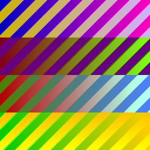
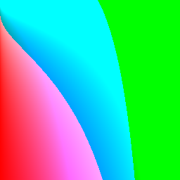
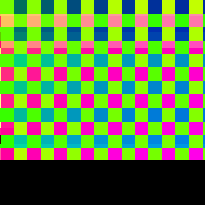
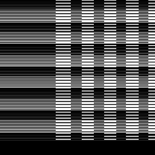
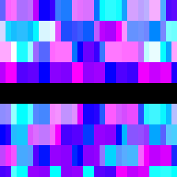
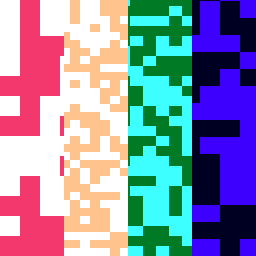
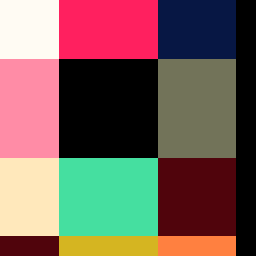
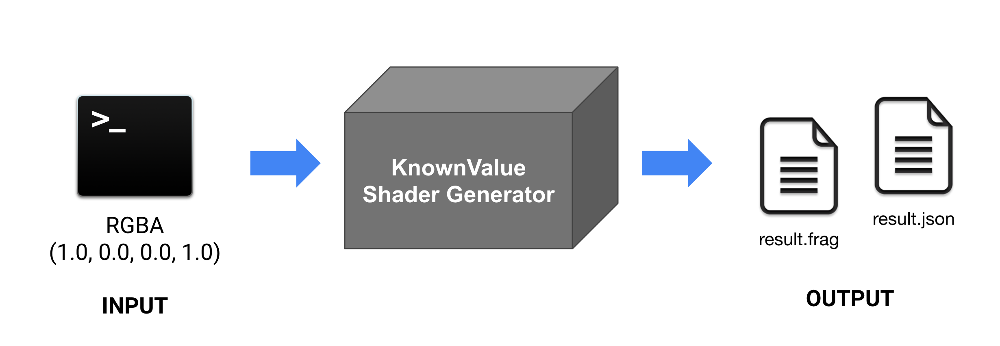

# Google Summer of Code 2019 Report - Jiradet Ounjai

The Google Summer of Code program has turned out to be a great learning opportunity for me. I gain fresh knowledge from my fantastic mentors through the discussions and the intense code reviews we had. I would like to thank my mentors for the time and energy you put into helping me.

I have made this document to summarize the work done for my Google Summer of Code project *Improve Shading Language Support in GraphicsFuzz*. 

###### Personal Links
###### [Github](https://github.com/jiradeto) - [Linkedin](https://www.linkedin.com/in/jiradeto/)

###### Project Link
###### [Improve Shading Language Support in GraphicsFuzz](https://summerofcode.withgoogle.com/projects/#4859963594244096)

###### Mentors
###### Alastair Donaldson, Paul Thomson

## Deliverables
My project idea focused on enhancing a shading language support in GraphicsFuzz. To accomplish the goal, I have improved the tool in various aspects which could be elaborated as follow:

- [Add support for GLSL Built-In Functions](#add-support-for-glsl-built-in-functions)
- [Add new ways to generate an opaque expression](#add-new-ways-to-generate-an-opaque-expression)
- [New sample shaders](#new-sample-shaders)
- [Enhancement for Reducer](#enhancement-for-reducer)
- [Use GraphicsFuzz to find bugs in other tools](#use-graphicsfuzz-to-find-bugs-in-other-tools)
- [New shader generator tool](#new-shader-generator-tool)

### Add support for GLSL Built-In Functions 
GLSL built-in functions are functions that available for use in a shader and GraphicsFuzz donates these built-ins into the unreachable statements so that they will not be actually executed. By providing a support for the GLSL built-ins, we teach GraphicsFuzz how to call functions appropriately by ensuring that the required function arguments are matched with the GLSL specifications. Moreover, we have to check that the built-in function being injected into a shader is compatible with the given shading language version. The following PRs have provided a support for the GLSL built-in functions.

[#554](https://github.com/google/graphicsfuzz/pull/554): Add support for GLSL built-in functions: Angle and Trigonometric Functions

[#555](https://github.com/google/graphicsfuzz/pull/555): Add support for GLSL built-in functions: Matrix Functions 

[#581](https://github.com/google/graphicsfuzz/pull/581): Add support for GLSL built-in functions: Geometric Functions 

[#585](https://github.com/google/graphicsfuzz/pull/585): Add support for GLSL built-in functions: Floating-Point Pack and Unpack Functions

[#592](https://github.com/google/graphicsfuzz/pull/592): Add support for GLSL built-in functions: Common Functions

### Add new ways to generate an opaque expression
Fuzzing a shader in GraphicsFuzz involves applying a number of transformations that might inject code fragment to the original shader aiming to generate a variant shader that is much larger than the original. Opaque expression, one of various expressions the generator employs when injecting code fragment, is an expression whose value is unknown by a compiler. Therefore, donating opaque expressions can help preventing the optimization performed by the compiler. In GraphicsFuzz, we have plenty of opaque expressions representing 0 and 1 however by introducing new opaque values we provide a new expression that is likely to trigger a new bug. The following PRs involve adding new opaque expressions to the GraphicsFuzz's generator.

[#413](https://github.com/google/graphicsfuzz/pull/413): Represent 1 as length of normalized vector

[#421](https://github.com/google/graphicsfuzz/pull/421): Enlarge test in OpaqueExpressionGeneratorTest

[#424](https://github.com/google/graphicsfuzz/pull/424): Represent 1 using cos() function

[#428](https://github.com/google/graphicsfuzz/pull/428): Represent 1 using exp(0.0)

[#429](https://github.com/google/graphicsfuzz/pull/429): Represent 0 using log(1.0)

[#447](https://github.com/google/graphicsfuzz/pull/447): Seperate functions making opaque 1 and 0

[#459](https://github.com/google/graphicsfuzz/pull/459): Represent 0 and 1 using abs(opaque)

[#472](https://github.com/google/graphicsfuzz/pull/472): Represent 0 as length of a zero vector

[#475](https://github.com/google/graphicsfuzz/pull/475): Rename opaque factories variable

### New sample shaders

In GraphicsFuzz, sample shaders play an important role in exposing bugs in shader compilers as they are the initial set of shaders that would be mutated whose final result are the variant shaders that might expose the potential compiler bugs. 

Having said that, we have only few sample shaders that come with GraphicsFuzz by default, the following PRs thus focus on adding a brand new set of 310 es sample shaders implementing different sorting and searching algorithms.

[#602](https://github.com/google/graphicsfuzz/pull/602): New 310es sample shaders - v1 

| trigonometric_strip.frag | selection_sort_struct.frag | prefix_sum_checkers.frag |
| :---: | :---: | :---: |
|  |  |  |

[#643](https://github.com/google/graphicsfuzz/pull/643): New 310es sample shaders - v2

| binarysearch_bw.frag | mergesort_mosaic.frag |
| :---: | :---: | 
|  |  |

[#660](https://github.com/google/graphicsfuzz/pull/660): New 310es sample shaders - quicksort 

| quicksort_palette.frag |
| :---: | 
|  | 

[#676](https://github.com/google/graphicsfuzz/pull/676): New 310es sample shaders - binary search tree

| binarysearch_tree.frag |
| :---: | 
|  | 

### Enhancement for Reducer 
To remove code fragment injected by the generator, we use reducer to shrink the variant shader into a very small and simple shader that is still inducing a bug. GraphicsFuzz' reducer essentially finds the interesting code fragment to be removed based on the reducer opportunities. Currently, we have sufficiently large set of reducer opportunities that can significantly reduce a variant shader. However, there were areas need improvement. The following PRs involve adding new reducer opportunities to the GraphicsFuzz's reducer aiming to help reducer reducing GLSL shaders more efficient:

[#477](https://github.com/google/graphicsfuzz/pull/477): Add tests for Simplify

[#489](https://github.com/google/graphicsfuzz/pull/489): Remove parentheses after eliminating macros

[#490](https://github.com/google/graphicsfuzz/pull/490): Reducer opportunity to remove redundant uniform metadata

[#500](https://github.com/google/graphicsfuzz/pull/500): Add macro wrapper and fix space before comma

[#508](https://github.com/google/graphicsfuzz/pull/508): Add a test for function call macro parentheses removal

[#513](https://github.com/google/graphicsfuzz/pull/513): Add class and tests : reduce VariablesDeclaration with expression

[#514](https://github.com/google/graphicsfuzz/pull/514): Add if_dead opportunities and fix fail tests

[#529](https://github.com/google/graphicsfuzz/pull/529): Implementation: Reducer Opportunity to replace variable declaration with an expression

[#538](https://github.com/google/graphicsfuzz/pull/538): Add test for const variable declaration

[#561](https://github.com/google/graphicsfuzz/pull/561): Reducer: Add class skeleton and tests

[#576](https://github.com/google/graphicsfuzz/pull/576): Reducer implementation: reduce global variable declarations to expression

[#622](https://github.com/google/graphicsfuzz/pull/622): Add reducer opportunities

### Use GraphicsFuzz to find bugs in other tools
GraphicsFuzz's team has discovered and reported a bunch of bugs lying in many different GPU vendors. In fact, we constantly run a graphics compiler test since we would be delighted if we could help developers detecting uncovering bugs. Over the past few months, I had a chance to use GraphicsFuzz to help finding bugs in [SPIRV Cross](https://github.com/KhronosGroup/SPIRV-Cross). 

SPIRV-Cross is a very convenient tool that helps parsing and converting SPIR-V to other shader languages. Throughout GSoC program, I relied heavily on this tool since I am using [MoltenVK](https://github.com/KhronosGroup/MoltenVK) to run SPIR-V on Mac and MoltenVK internally calls SPIRV-Cross to convert SPIR-V into Apple's Metal Shading Language.

To see all SPIRV-Cross issues I filed please check [here](https://github.com/KhronosGroup/SPIRV-Cross/issues?utf8=%E2%9C%93&q=+is%3Aissue+author%3Ajiradeto+).

 
### New shader generator tool

GraphicsFuzz has now equipped with a new tool called Known Value Shader Generator which generates a shader job from the given RGBA colors. This tool mutates the numeric inputs by applying various transformations which eventually generates the mutated expressions that guarantee to produce the original input values. With the help of this tool, we have a brand new way to generate a variant shader just by simply providing the expected values.

The following PRs involve implementing a new shader generator tool.

[#625](https://github.com/google/graphicsfuzz/pull/625): Add a new tool: Known Value Shader Generator

[#677](https://github.com/google/graphicsfuzz/pull/677): Expression Generator: add global initializer method

[#681](https://github.com/google/graphicsfuzz/pull/681): Expression Generator: find numbers for addition based on known facts

[#693](https://github.com/google/graphicsfuzz/pull/693): Expression Generator: introduce uniforms

#### Future development
Currently, the shader generator tool has a limited number of transformations. The next steps for this tool involve extending transformations set and integrating this tool into the fuzzing chain of GraphicsFuzz. Afterward, it would also be interesting to apply new capabilities of GraphicsFuzz armed with the new tool to find bugs in shader compilers.

